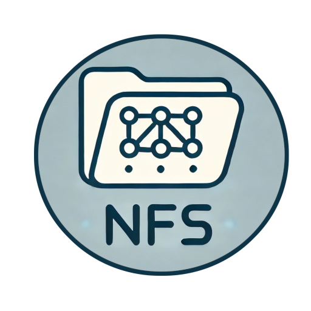
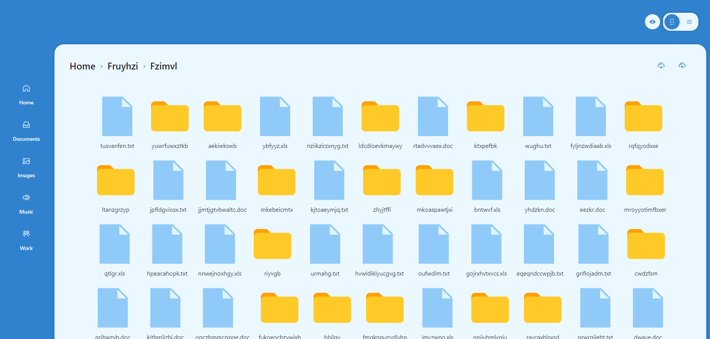

# **fe-react-poc-nfs (Proof of Concept, Network File System)**

<p align="center">
  
</p>


> **Version**: `0.1.0`

A proof-of-concept application simulating a client-side network file system like Google Drive, developed with React. This project focuses on creating an optimal frontend toolchain for scalable and maintainable applications.

---

 <!-- Placeholder: Replace with actual image -->

---

## **Features**

✅ Modular architecture for scalability and maintainability.  
✅ Global state management with Redux.  
✅ Dynamic routing with React Router DOM.  
✅ Runtime code splitting for optimized performance.  
✅ Reusable UI components with Chakra UI.  
✅ NFS-like functionalities for managing and navigating files.  

---

## **Important Notice**
🚨 This project is a Proof of Concept (PoC) and is not intended for production use. It is not actively maintained or updated.
The purpose of this project is to demonstrate a concept or explore a technical implementation. There may be bugs or outdated dependencies.

---

## **Installation**

### Prerequisites

Make sure you have the following installed:
- **Node.js**: `>= 18.0.0`
- **Yarn**: `>= 4.0.0`

### Installation Steps

1. **Clone the repository**:
   ```bash
   git clone <repository_url>
   cd fe-react-poc-nfs
   ```

2. **Install dependencies**:
   ```bash
   yarn install
   ```

3. **Configure environment variables**:  
   Create a `.env` file in the root directory:
   ```env
   REACT_APP_API_BASE_URL=http://localhost:5000
   NODE_ENV=development
   ```

---

## **Usage**

### Development Mode
Run the project in development mode:
```bash
yarn start:dev
```

### Production Build
Create an optimized production build:
```bash
yarn build:prod
```

### Clean the Project
Remove generated files and dependencies:
```bash
yarn clean
```

---

## **Project Structure**

```
src/
├── assets/          # Static assets and configuration files
├── components/      # Reusable React components
├── containers/      # Modular containers for specific features
├── pages/           # Application pages
├── services/        # API service and utilities
├── store/           # Redux store and reducers
├── App.jsx          # Main application component
├── index.jsx        # Entry point
└── routes.jsx       # Route definitions
```

---

## **Documentation**

The application replicates NFS-like functionalities using:
- Modular containers for state encapsulation.
- Dynamic routing for seamless navigation.
- Runtime code splitting for enhanced performance.

### Technologies Used:
- **React**: Core library for UI development.
- **Redux**: Global state management.
- **React Router DOM**: Dynamic routing and navigation.
- **Chakra UI**: Reusable UI components.
- **Framer Motion**: Smooth animations.
- **Faker.js**: Mock data generation.

---

## **License and Data Attribution**

This project is distributed under the MIT License. See the [LICENSE](LICENSE) file for details.

---

## **Author**

Project created by **5h1ngy**.